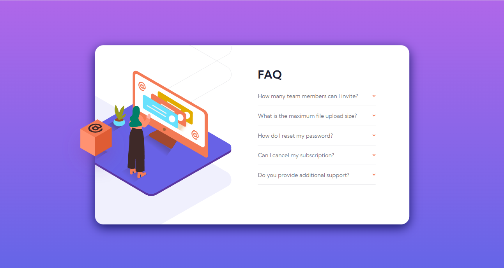
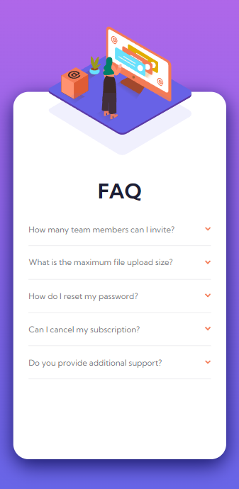

# Frontend Mentor - FAQ accordion card solution

This is a solution to the [FAQ accordion card challenge on Frontend Mentor](https://www.frontendmentor.io/challenges/faq-accordion-card-XlyjD0Oam). 

## Table of contents

- [Overview](#overview)
  - [The challenge](#the-challenge)
  - [Screenshot](#screenshot)
  - [Links](#links)
- [My process](#my-process)
  - [Built with](#built-with)
  - [Useful resources](#useful-resources)
- [Author](#author)

## Overview

### The challenge

Users should be able to:

- View the optimal layout for the component depending on their device's screen size
- See hover states for all interactive elements on the page
- Hide/Show the answer to a question when the question is clicked

### Screenshot

-Desktop View

-Mobile View

### Links

- Solution URL: https://github.com/priyanshu-mishr/faq-accordion-card.git
- Live Site URL:  https://priyanshu-mishr.github.io/faq-accordion-card/

## My process

### Built with

- Semantic HTML5 markup
- CSS custom properties
- Flexbox
- CSS Grid

### Useful resources

- [Google Fonts](https://fonts.google.com/) 

## Author

- Frontend Mentor - [@priyanshu-mishr](https://www.frontendmentor.io/profile/priyanshu-mishr)

